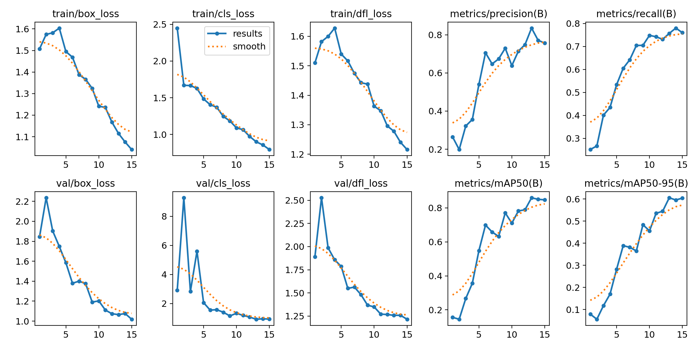

# 🔥 Fire Detection System

A computer vision-based project that detects fire in images, videos, or real-time webcam feeds using YOLOv8 model.

This project works via **Camera** and **scanning images**


---

## Clone Repository

```bash
git clone https://github.com/deepanshuXrawat/fire_detection_using_YOLOv8.git
cd fire_detection_using_YOLOv8
```


## Requirements

```bash
python -v 3.9.13 / 3.12.7
```


## Import Modules

```bash
pip install -r requirements.txt
```

## How to Run

```bash
python main.app
```

--- 


## 🔥 How to Train and Run the Model

1. **Upload `main.ipynb` to Google Drive**
   - Open [Google Drive](https://drive.google.com/)
   - Upload the `main.ipynb` file to your preferred folder.

2. **Login to [Roboflow](https://roboflow.com/) and Download the Dataset**
   - Go to: [Continuous Fire Dataset](https://universe.roboflow.com/-jwzpw/continuous_fire/dataset/6#)
   - Download the dataset in **YOLOv8** format.
   - Copy the dataset download **code snippet** provided by Roboflow.

3. **Replace the Dataset Download Code in `main.ipynb`**
   - Open `main.ipynb` in **Google Colab**.
   - Replace the dataset download cell with the **YOLOv8 download code** you copied from Roboflow.

4. **Run All Cells in Colab**
   - Click on `Runtime` → `Run all` in the Colab toolbar.
   - Make sure training completes without errors.

5. **Download the Trained Model**
   - After training, download the exported model weights (usually `.pt` file) from Colab.

6. **Run `main.py` Locally**
   - Ensure your environment is set up.
   - Run:
     ```bash
     python main.py
     ```

---

## Training Result


## Model Result

    
---

**Note:**  
Use Google Colab for better and faster processing for model training

If you need help with setting up Colab or running `main.py`, feel free to ask!
